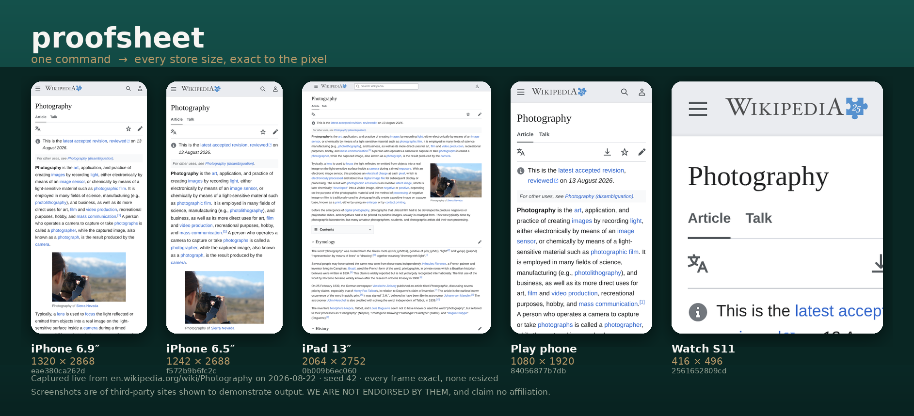

<h1 align="center">proofsheet</h1>

<p align="center">
  <strong>Exact-pixel App Store and Google Play screenshots from a real browser.</strong><br>
  Deterministic · local-first · no cloud
</p>

<p align="center">
  <a href="https://crates.io/crates/proofsheet"></a>
  <a href="https://www.npmjs.com/package/@interchained/proofsheet"></a>
  <a href="https://pypi.org/project/proofsheet/"></a>
  <a href="https://github.com/interchained/proofsheet/actions"></a>
  <a href="LICENSE"></a>
</p>

<p align="center">
  
</p>

<p align="center"><sub>
  Real output. Captured live from <code>en.wikipedia.org</code> in one command, five device sizes, every frame exact.<br>
  Screenshots show third-party sites purely to demonstrate output — <strong>we are not endorsed by them</strong> and claim no affiliation.
</sub></p>

```bash
proofsheet capture --url http://localhost:5173 --store apple --out ./shots
```

```
  1/5   apple-iphone-6-9-1320          1320x2868  exact       1.0s  3caaf8e4da1641be
  2/5   apple-iphone-6-5-1242          1242x2688  exact      844ms  42d1a2a63605f0ae
  3/5   apple-ipad-13-2064             2064x2752  exact       1.0s  4d23855e4c8f44e3
  4/5   play-phone-portrait            1080x1920  exact      788ms  11cadea3fcfdffde
  5/5   apple-watch-s11                  416x496  exact      663ms  4180c0a7a3e5346f

5 exact, 0 off-size, 0 failed in 4.4s
```

**Source:** [github.com/interchained/proofsheet](https://github.com/interchained/proofsheet)

A *proof sheet* is the contact sheet a photographer reviews before choosing which frames to print. This does both halves: it **proves** (deterministic runs, verifiable output) and it produces the **sheet** (every screenshot your store asks for, at exactly the size it asks for).

---

## Point it at anything a browser can open

There is no "local mode" and no "remote mode" — `--url` takes a URL. All four of these are ordinary usage:

```bash
# a local dev server — the one you usually want
proofsheet capture --url http://localhost:5173 --store apple --out ./shots

# a static build, no server at all
proofsheet capture --url file://$PWD/dist/index.html --store apple --out ./shots

# a preview deploy
proofsheet capture --url https://pr-482.preview.example.com --store apple --out ./shots

# production
proofsheet capture --url https://your.app --store apple --out ./shots
```

**Prefer localhost.** Not as a fallback — as the default:

- **You capture before you ship.** The set is built from the branch you're about to release, so it can *gate* the release instead of documenting it afterwards.
- **CI needs no deploy and no public URL.** Start your dev server, capture, upload. proofsheet's own CI does exactly this.
- **It's hermetic.** A live domain drags in CDN state, cookie banners, A/B buckets and analytics — all of which move between runs and destroy byte-identical determinism. Localhost doesn't.
- **It's faster.** Measured on the same page: `366ms` local vs `1.6s` over the network. Across a 44-device matrix that's the difference between about 25 seconds and a couple of minutes.
- **It works on apps that aren't public yet**, or are behind auth.

Two things worth knowing before they bite you:

**`file://` is not a real origin.** It's the fastest path and it's fine for genuinely static pages, but `fetch`, service workers, ES module imports and anything CORS-sensitive behave differently there than they will in production. If your app does real work, run the dev server and point at `localhost`.

**Inside Docker, `localhost` means the container.** If proofsheet runs in a container while your dev server runs on the host, use `host.docker.internal` or `--network host`.

## Why

Store screenshot sets rot. They get taken by hand, at different moments, on different builds — one shot says 3:47 and the next says 9:12, a list reshuffles between frames, "2 hours ago" quietly becomes "3 days ago". Then a redesign lands and somebody spends two days redoing all of them.

proofsheet makes the whole set a build artifact. Same seed, same output, byte for byte. Rerun after a redesign and the only things that changed are the things you changed.

## What makes the pixels exact

Two decisions, both structural rather than careful:

**Output pixels are the source of truth.** Apple and Google publish requirements in output pixels — `1320 x 2868`, `1024 x 500`. Browsers are driven in CSS pixels plus a device pixel ratio. Storing the CSS size and multiplying is the obvious design and it is the wrong one, because it permits a preset that cannot produce a required size — and you find out at upload. So a preset stores the **required output size** and derives the viewport as `output / scale`. Any preset where that division isn't exact is rejected at parse time.

**Metrics are applied before layout.** `Emulation.setDeviceMetricsOverride` runs before navigation, so first layout already happens at the target size, and `Page.captureScreenshot` emits exactly those pixels. Nothing is resized, cropped, or padded after the fact. The image is born the right size.

## What makes runs deterministic

A preamble is injected via `Page.addScriptToEvaluateOnNewDocument`, so it runs before any page script on every document. It replaces `Math.random` with a seeded PRNG, freezes `Date.now` and `performance.now`, drives `requestAnimationFrame` on a fixed virtual step, and routes `crypto.getRandomValues` through the seeded stream. Locale and timezone are pinned through CDP rather than script, because the script-level overrides don't reach Intl's internal data.

Verified in both directions: same seed produces byte-identical PNGs across independent browser launches, and a different seed produces different bytes. The second half is the part that makes the first half evidence instead of a green check.

## Device presets

46 presets, every store size read from official documentation on 2026-08-22:

- **Apple** — iPhone 6.9″/6.5″/6.3″/6.1″/5.5″/4.7″, iPad 13″/11″/10.5″/9.7″, Mac, Apple TV, Vision Pro, Apple Watch
  <br><sub>[App Store Connect Help → Screenshot specifications](https://developer.apple.com/help/app-store-connect/reference/screenshot-specifications/)</sub>
- **Google Play** — feature graphic, phone, 7″/10″ tablet, Wear OS, Automotive, TV banner and screenshot
  <br><sub>[Play Console Help → Add preview assets](https://support.google.com/googleplay/android-developer/answer/9866151)</sub>

Presets are **data**, in `presets/devices.json`. Stores change these numbers without warning, and a requirement that can only be corrected by cutting a release is a requirement that will be wrong. Point `--presets` at your own file to override. Every entry carries the URL it came from, and the test suite refuses to let an entry claim `verified` without one.

```
proofsheet devices --store apple --mandatory
```

## Install

```
cargo install proofsheet          # crates.io
npm  i -g @interchained/proofsheet # npm      (planned)
pip  install proofsheet            # PyPI     (planned)
```

You also need a Chromium. proofsheet will fetch a pinned
[Chrome for Testing](https://googlechromelabs.github.io/chrome-for-testing/) build for you:

```bash
proofsheet install-browser              # current Stable
proofsheet install-browser --version-tag 152.0.7977.54   # or pin one
```

It lands under `~/.proofsheet/browser` (`PROOFSHEET_HOME` overrides) and every
surface — CLI, Node, Python — finds it automatically with no configuration.
To use a browser you already have, point `PROOFSHEET_CHROME` at it instead.

A pinned build matters more than it sounds: desktop Chrome auto-updates
underneath you, so the browser producing your screenshots changes without you
asking and the images churn.

## Scope, honestly

**In scope:** anything that renders in a browser engine — web apps, PWAs, and **Capacitor / web-view apps, where the web view genuinely is the app**.

**Out of scope:** true native Swift or Kotlin apps. Those need a simulator, and no amount of Chromium gets you there. If that's what you have, this is the wrong tool and you should know that before you install it rather than after.

## Status

v0.1 is the capture path: exact-pixel captures, determinism, device presets, CLI.

Next, in order: hash-chained receipts in [NEDB](https://github.com/Eth-Interchained/nedb) so every image is content-addressed against the state and commit that produced it; the locale × theme matrix; a scoped compositor for device frames and caption bands; then the agent-driven test path — Explorer, Oracle, and a Reducer that shrinks a failing run to its minimal reproducing sequence.

Dependencies are deliberately few: no async runtime, no browser automation framework. The WebSocket and CDP client are about 500 lines of `std`.

## Trademarks and third-party screenshots

Screenshots in this repository and on the package pages show third-party
websites solely to demonstrate what proofsheet outputs. **We are not endorsed
by them, sponsored by them, or affiliated with them in any way.** All product
names, logos, and brands are the property of their respective owners, and are
used here nominatively — to identify what is pictured, nothing more.

Apple, App Store, iPhone, iPad, Apple Watch and Apple Vision Pro are
trademarks of Apple Inc. Google Play, Android, Wear OS and Chrome are
trademarks of Google LLC. proofsheet is an independent tool and is neither
produced by nor endorsed by Apple or Google.

## Contact

- Web — [interchained.org](https://interchained.org)
- Source — [github.com/interchained/proofsheet](https://github.com/interchained/proofsheet)
- Issues — [github.com/interchained/proofsheet/issues](https://github.com/interchained/proofsheet/issues)
- Email — [dev@interchained.org](mailto:dev@interchained.org)

## License

[BUSL-1.1](LICENSE), converting to **MIT** on 2030-08-22. Production use is granted; offering proofsheet itself as a hosted service is not.

Property made in part by **Interchained LLC Labs**.

© 2026 Interchained LLC
